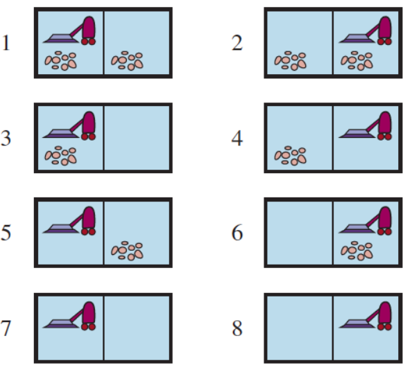

<h1 align="center">IA - Agentes Inteligentes</h1>

<h3 align ="center">Agente Reativo Simples</h3>

Atividade de Inteligência Artificial que consiste na implementação de um agente reativo simples que simule a atuação de um aspirador de pó inteligente. Foi dado as configurações iniciais (localização inicial do robô e posições de sujeira) dos possíveis ambientes. A partir desses dados, foi proposto a execução do aspirador para todas as configurações dadas e a determinação de métricas de desempenho e pontuações para avaliar a racionalidade do agente.

  
   Possı́veis estados do agente aspirador de pó.

